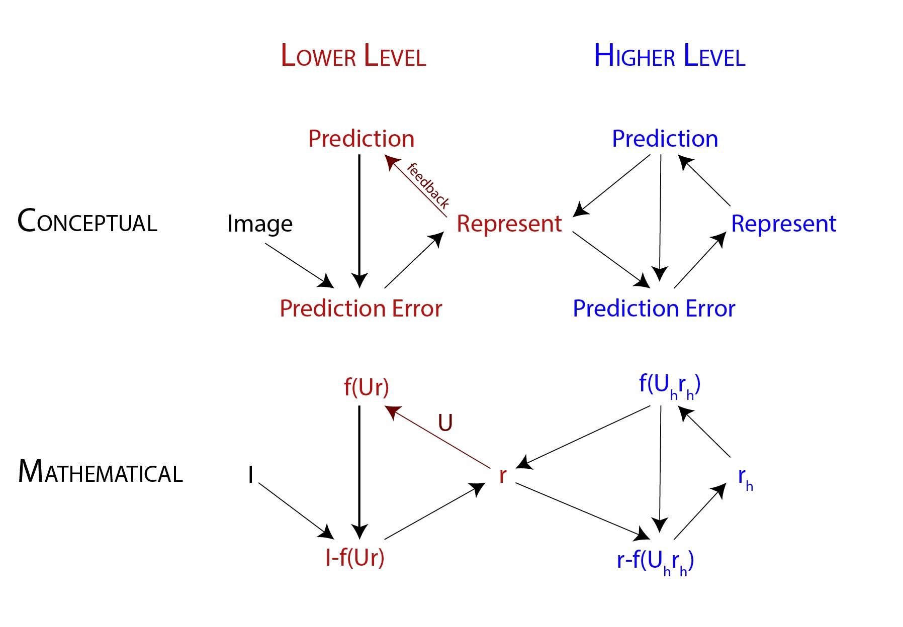

# NDDL-predictive-coding
Team Parva:

Intro: 
> Predictive coding

## Todo list:
- Optimize code for batch training
- (Individually) Write out project proposal plans
- ...  

## Possible extensions:
- Supervised learning
- Improve the quality of the latent representations learnt by the model (Changing architecture, Connecting the two modalities at earlier layers, lateral inhibition, precision weighting, etc)
- Extend the model (Other modalities, temporal dynamics, mini-batches, etc)
- Improve biological plausibility of the model (More realistic architectures, Excitatory/Inhibitory neurons, etc)
- Content-addressable memory: denoising and occlusion (Salvatori et al., 2023, p. 7; Papadimitriou et al., 2020)
- Learning rate decay mechanism (e.g. RMSprop). Also: decay of update ratios between representation and weights. 
- Storage capacity auto-associative memory (i.e. calc max storage capacity; Salvatori et al., 2021)
- Lateral processing between different modalities
- Non-symmetrical weights (as in neural generative coding)
- Implement probability distribution (Rao & Ballard -> FEP)

## Multi-Model Datasets:
- https://johnarevalo.github.io/2015/02/18/multimodal-datasets.html
- https://github.com/drmuskangarg/Multimodal-datasets

## To do biologically plausible projects
- [x] vind een 1 speaker die consistent is. (~500 files)
- [x] hyperparameters voor spectogram (fft, mels, etc)
- [x] check filter functie, blijven alle nummers evenveel gerepresenteerd? (distributie van labels maken die eruit worden gehaald bv)
- [x] corrupt files eruit halen in het geval dat die er zijn
- [x] check dimensies van spectogrammen voor inputlaag model
- [x] Make same amount of visual and audio data for each category
- [x] kijk naar Parva's new_model.py voor de extra line
- [ ] make extra layer for labels for supervised training (i.e., clamping a label)
- [ ] trainen (plot MSE), inference, reconstructen (print r van alle lagen), crossmodality.
- [ ] supervised learning, bij training (clamped input (audio en visueel) en output (output unit voor bv de 1)).
- [ ] reconstructie op basis van label van beiden modalities, en als je nog 1 sensor hebt.

## Rutger
- [ ] Implement Receptive Fields in the visual modality
- [ ] Train the auditory modality in Network() to determine hyperparameters (network layers, n_nodes, epochs?)
- [ ] Decrease layers in joint modality!

## Questions for Parva
- Why does the model not include top-down errors?
- How do we calculate the MSE for reconstruction after sensor drop out, since we cannot compare any longer with a given input. Maybe compare the predicted input with the average of all inputs?
